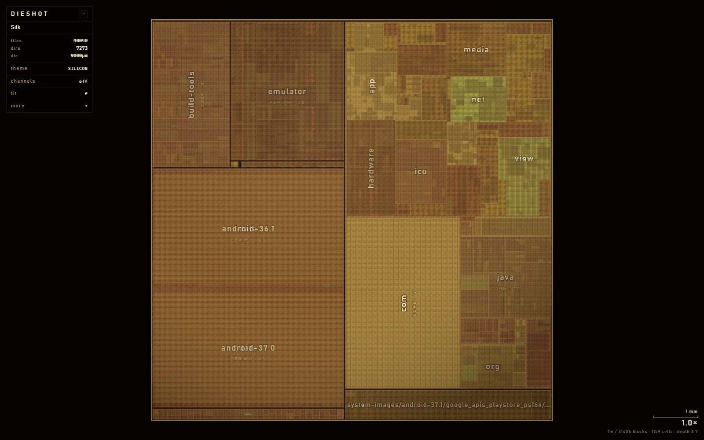
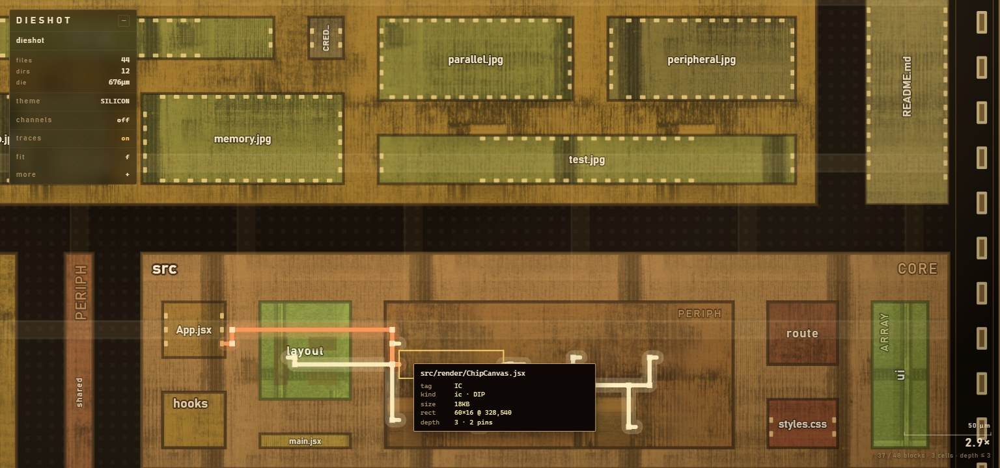

# dieshot

Turns a folder into a chip die shot.

Code visualizers always draw the same thing: a blob of dots connected by lines.
But a folder tree isn't a blob. It's boxes inside boxes. Chips are also boxes
inside boxes, and chip people have spent forty years working out how to pack
them nicely. So I borrowed their algorithm.

Point it at a repo and you get this:



Hover a file and it wires up its imports through the gaps between blocks:



## Run it

```bash
npm install
npm run scan -- /path/to/some/repo
npm run dev
```

Then open http://localhost:5173.

There's also a box in the panel where you can paste a path and rescan without
restarting anything.

Keys: drag to pan, scroll to zoom, `f` to fit, `t` for theme, `c` shows the
wiring channels, `r` toggles traces, `h` hides the panel.

If you point it at something huge (I tried a 40k file folder) use
`npm run build && npm run preview` instead. Dev mode is much slower because
React renders everything twice.

## How it works

**Scanning.** Walks the folder, skips `node_modules` and friends, and tags each
directory by its name. Anything called `models` or `db` gets treated as memory,
`components` as an array of identical cells, `utils` as peripheral glue. It's
one table in `shared/types.js`, go edit it.

Then it greps every source file for imports. Regex, not a real parser. Handles
JS/TS, Java/Kotlin and Python. Anything pointing at an npm package gets dropped
since there's no block on screen to point at.

**Placing.** This is the actual chip bit. Take a rectangle, cut it in two, keep
cutting. That's a slicing floorplan. The nice part is that if you make every cut
a bit wider than a line you get a gap, and all those gaps join up. So there's
always a path from any block to any other block that never crosses anything.

Which way you cut depends on the tag. Memory always cuts vertically so you get
column strips like real memory banks. Component folders alternate cuts so they
come out as a grid. Utils cuts the short side so you get long thin strips.

Block sizes come from file sizes, square rooted by default, otherwise one 2MB
png eats the whole chip.

**Zooming.** It doesn't draw everything at once. A block only opens up when it's
big enough on screen to be worth opening, so you start with a handful of big
labelled blocks and dig in from there. While a level is fading in it gets
blurred a little, like focusing a microscope.

A closed block isn't empty either. It shows its real contents as flat little
cells, so a folder with twelve icons in it looks like a grid of twelve things,
because it is one.

**Wiring.** Hover a file and it routes its imports. A\* on a grid, with a
penalty for turning so the wires come out as long straight runs instead of
staircases. It only bothers with targets that are currently on screen, otherwise
you're searching across the whole chip for a wire you can't even see.

**Making it look right.** The block textures are crops of a real die photo
(public domain, credits at the bottom), turned grayscale and tinted per block
type. On top of that: a power grid running over everything, filler metal in the
gaps, bond pads round the edge. Text is DIN 1451, because a code font makes it
look like a terminal and nothing on a real chip is set in Consolas.

## Tests

`npm run check` scans a real folder and checks the geometry actually holds up:

- no two blocks overlap
- everything stays inside its parent
- gaps are at least as wide as they're meant to be
- nothing ever gets placed inside a channel
- every wire is right angles only, and never crosses a block

That last one is sort of the whole point. If wires could cut straight through
blocks then reserving the gaps would be pointless.

## Speed

Numbers from the Android SDK folder, 40k files:

| | |
|---|---|
| scan | 6.5s |
| import extraction | +13s, 121k edges |
| layout | 121ms |
| load in browser | 142ms |
| memory | 61MB |
| DOM nodes | 1723, for 41k blocks |

Most of that came from four fixes: skipping whole subtrees when the parent is
off screen, measuring the cull margin in screen pixels instead of chip units,
budgeting DOM nodes instead of blocks, and culling the bond pad ring, which was
quietly 4000 nodes of stuff nobody could see.

## Where the ideas came from

Drawing code as a chip was my own idea, but nearly every hard part turned out to
be solved already somewhere else, so here's who actually did the work.

**Floorplanning.** Slicing structures come from VLSI. Otten, *Automatic
Floorplan Design* (DAC 1982) for the binary tree version, and Wong & Liu, *A New
Algorithm for Floorplan Design* (DAC 1986) for the Polish expression one. I use
the structure but not the annealing search, since the cut order here is just the
folder tree. Sherwani's *Algorithms for VLSI Physical Design Automation* covers
floorplanning and channel routing properly if you want the real thing.

**Routing.** Lee, *An Algorithm for Path Connections and Its Applications*
(1961), is the granddad of every maze router. Mine is A\* with a turn penalty,
same family. Routing after placement, into the gaps placement left behind, is
just how chip tools work. See Deutsch, *A Dogleg Channel Router* (DAC 1976).

**Treemaps.** Worth being upfront about this one: a size weighted slicing
floorplan basically is a treemap. Shneiderman's original slice and dice treemap
from 1991 does the same recursive cutting, and "cut the longer side" is the
squarify trick from Bruls, Huizing and van Wijk (2000). What's different here is
the reserved gaps, the per type cut rules, and actually routing edges through
the result, which treemaps don't do because a treemap has nothing to route.

**Code as a physical thing.** Wettel and Lanza's CodeCity (2007) draws software
as a city. Gource and SourceTrail are in the same neighborhood.

**Zooming.** Perlin and Fox, *Pad* (SIGGRAPH 1993), and Pad++ after it. Content
changing as you zoom instead of just getting bigger.

**The look.** Die photography by Fritzchens Fritz, released CC0. The textures
are crops of his AMD Athlon K7 shot from Wikimedia Commons, see
`public/textures/CREDITS.md`. The scale bar and magnification readout are
standard micrograph stuff. Lettering is DIN 1451.

## Credits

Textures come from a CC0 die photo by Fritzchens Fritz. Public domain, no
attribution needed, but it'd be rude not to.
